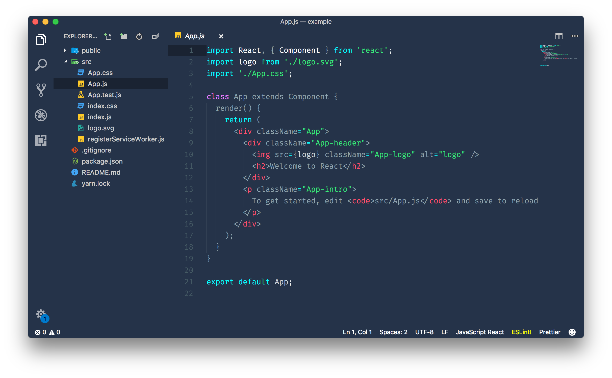
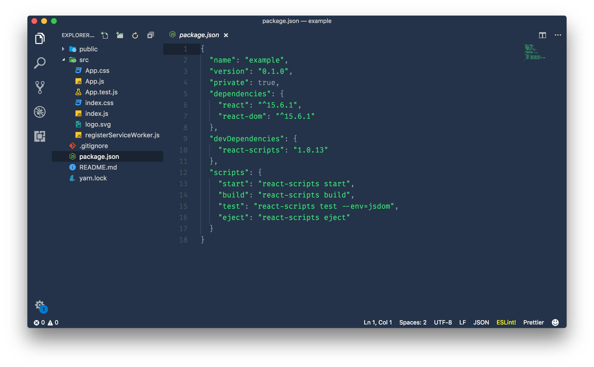
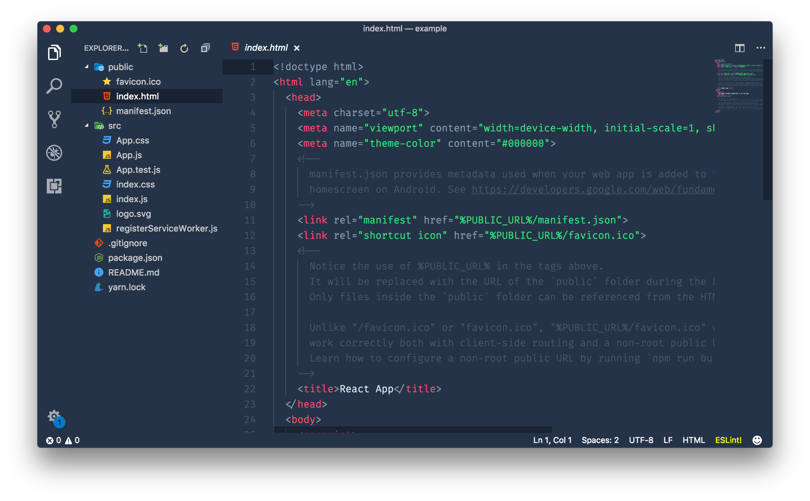
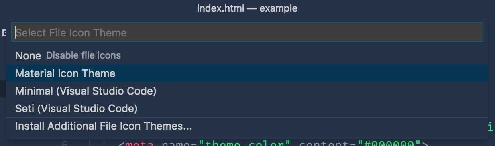
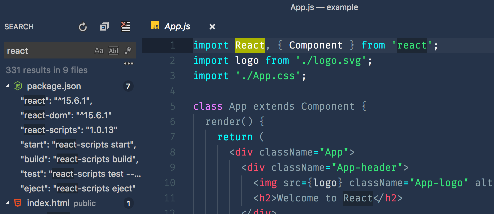

# Deep Water Colour Theme for VSCode

_Warning: this theme is not ready for distribution. Try it out if you want to, but don't expect a lot of support. If you want to make changes, it's probably better you keep your own fork. If your changes don't align with my roadmap it's unlikely I'll accept a PR. All that being said, contributions and bug fixes **are** welcome, and I do hope you find this theme useful in some small way_ 🙂 —Christian

## Why is this theme different?

Well, I'm not sure it is. But here is why I made it: I find most dark themes use a lot of different colours (yes, that is the proper way to spell colour 😉🇨🇦🇬🇧) which I personally find hard to visually parse. My intentions for this theme is to use a lot of neutral tones and sprinkle in brighter colours only when it actually helps. I don't have any specific method for doing this, I just use my _feelings._

## What does it look like?

## What needs fixing?

Lots of things. I've really only used it in js/x, json, Python, and Ruby, and it could use some work in Ruby. I know for a fact it looks pretty awful in Objective C.

Highlighting in the command palette thingy looks pretty bad. That's probably next on my list if things to fix.

I hate the search and keyword highlighting too, but honestly I'm not sure exactly how to fix it, so I just suffer. Ideas here are more than welcome.

I could probably publish it to the Extensions Marketplace, but it doesn't feel ready for that – plus who's got the time?

## License

Do whatever you like. Just don't try to copyright it for your self and try to sue me or anything stupid like that.