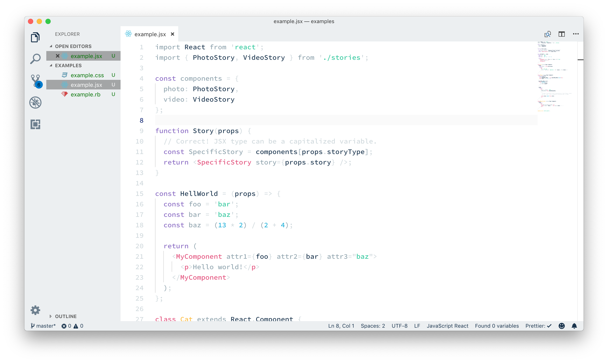
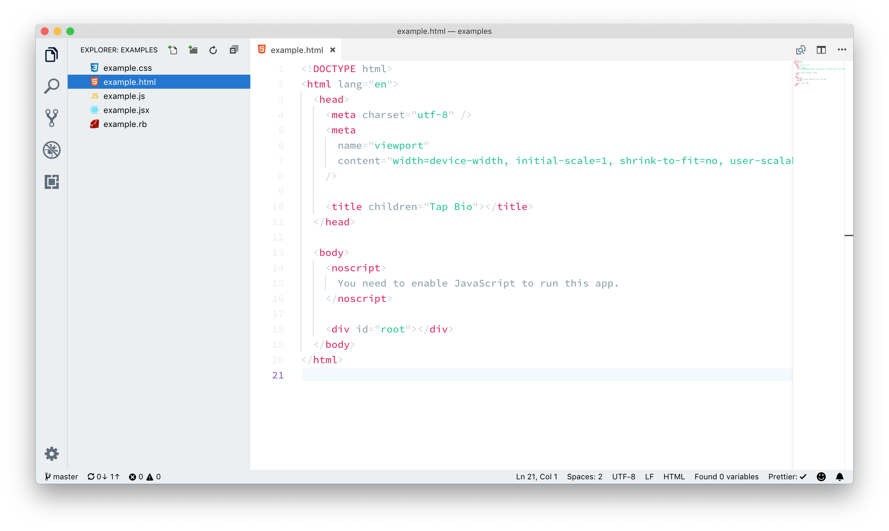
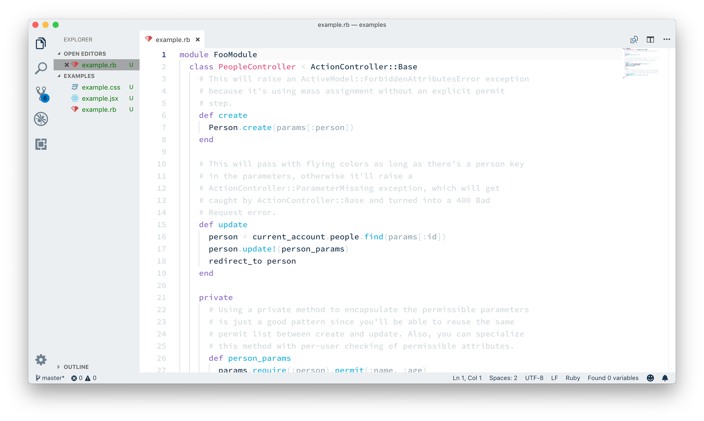
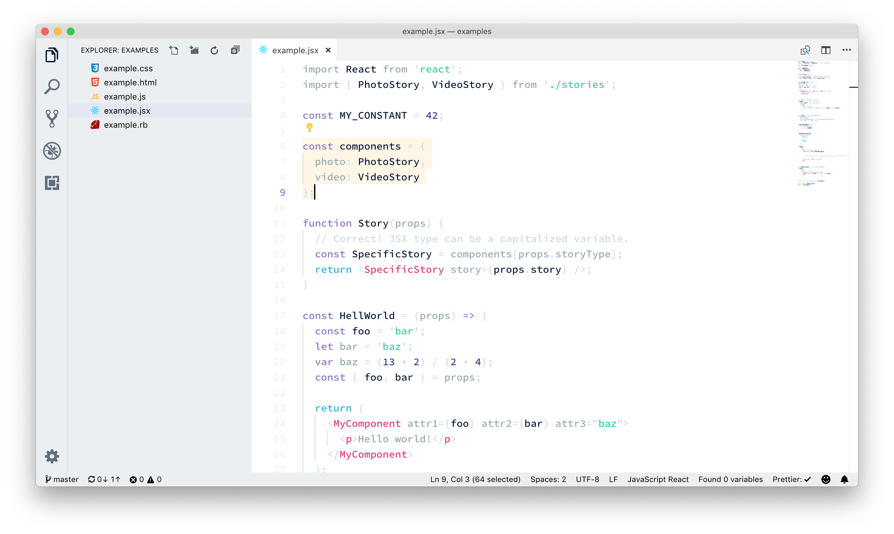
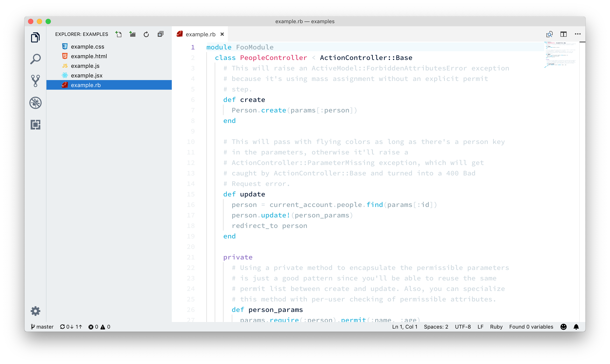

# Cloud City Light Theme for VSCode

_Warning: NOT READY FOR PUBLIC USE_

## Why is this theme different?

I find most too colourful which I personally find hard to visually parse. My intentions for this theme is to use a lot of neutral tones and sprinkle in brighter colours only when it actually helps. I don't have any specific method for doing this, I just use my _feelings._

## What does it look like?

## What needs fixing?

This readme.

## License

MIT. Do whatever you like. Just don't try to copyright it for your self and try to sue me or anything stupid like that.

## Inspiration

- https://dribbble.com/shots/5591366-Mahameru-Landing-Page
- https://dribbble.com/shots/3229795-Neutral-Colours

## Icon Attribution

[Rain icons created by Freepik - Flaticon](https://www.flaticon.com/free-icons/rain)
