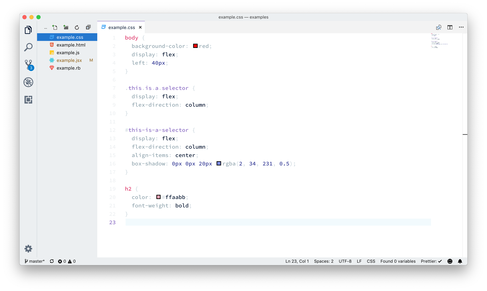
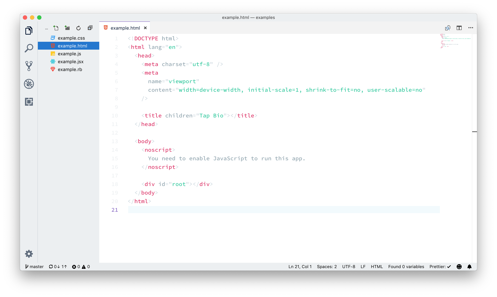
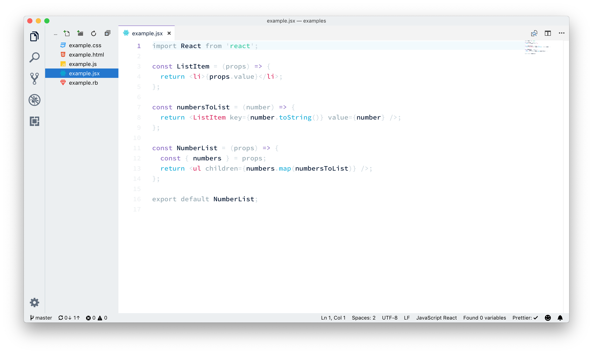
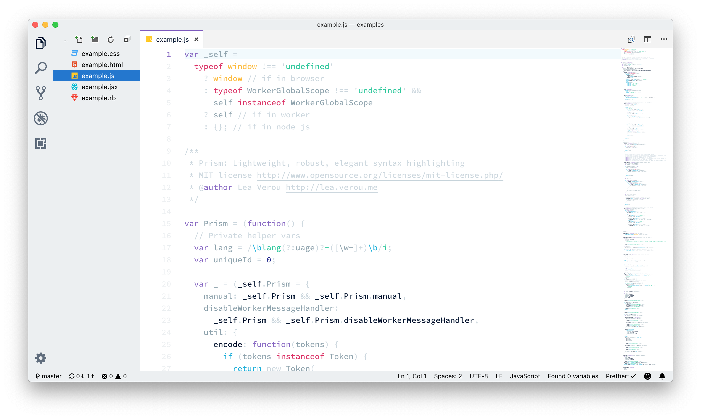

# Cloud City Light Theme for VSCode

_Warning: NOT READY FOR PUBLIC USE_

## Why is this theme different?

Well, I'm not sure it is. But here is why I made it: I find most too colourful (yes, that is the proper way to spell colour 😉🇨🇦🇬🇧) which I personally find hard to visually parse. My intentions for this theme is to use a lot of neutral tones and sprinkle in brighter colours only when it actually helps. I don't have any specific method for doing this, I just use my _feelings._

## What does it look like?

## What needs fixing?

This readme.

## License

Do whatever you like. Just don't try to copyright it for your self and try to sue me or anything stupid like that.

## Inspiration

https://dribbble.com/shots/5591366-Mahameru-Landing-Page
